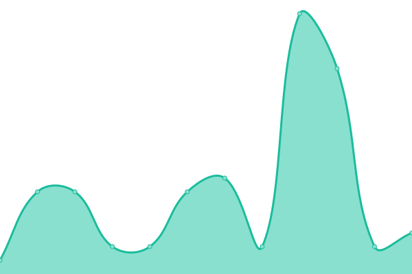
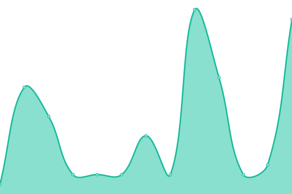

# [📈 Live Status](https://crisvzq.github.io/iptv-monitor): <!--live status--> **🟧 Partial outage**

This repository contains the open-source uptime monitor and status page for [crisvzq](https://crisvzq.github.io/iptv-monitor), powered by [Upptime](https://github.com/upptime/upptime).

With [Upptime](https://upptime.js.org), you can get your own unlimited and free uptime monitor and status page, powered entirely by a GitHub repository. We use [Issues](https://github.com/crisvzq/iptv-monitor/issues) as incident reports, [Actions](https://github.com/crisvzq/iptv-monitor/actions) as uptime monitors, and [Pages](https://crisvzq.github.io/iptv-monitor) for the status page.

<!--start: status pages-->
<!-- This summary is generated by Upptime (https://github.com/upptime/upptime) -->
<!-- Do not edit this manually, your changes will be overwritten -->
<!-- prettier-ignore -->
| URL | Status | History | Response Time | Uptime |
| --- | ------ | ------- | ------------- | ------ |
|  [[AMERICA] Panel](http://icomplay.net/ICOMPLAY/login) | 🟩 Up | [america-panel.yml](https://github.com/crisvzq/iptv-monitor/commits/HEAD/history/america-panel.yml) | 

 360ms
     
 | 

<a href="https://crisvzq.github.io/iptv-monitor/history/america-panel">100.00%</a>
    

|  [[AMERICA] DNS 1](http://icomplay.net) | 🟩 Up | [america-dns-1.yml](https://github.com/crisvzq/iptv-monitor/commits/HEAD/history/america-dns-1.yml) | 

 259ms
     
 | 

<a href="https://crisvzq.github.io/iptv-monitor/history/america-dns-1">100.00%</a>
    

|  [[AMERICA] DNS 2](http://iptvglobal.site) | 🟥 Down | [america-dns-2.yml](https://github.com/crisvzq/iptv-monitor/commits/HEAD/history/america-dns-2.yml) | 

 0ms
     
 | 

<a href="https://crisvzq.github.io/iptv-monitor/history/america-dns-2">4.45%</a>
    

|  [[AMERICA] DNS 3](http://latinostream.xyz) | 🟩 Up | [america-dns-3.yml](https://github.com/crisvzq/iptv-monitor/commits/HEAD/history/america-dns-3.yml) | 

 244ms
     
 | 

<a href="https://crisvzq.github.io/iptv-monitor/history/america-dns-3">100.00%</a>
    

|  [[LATINO] Panel](https://mv-play.uk:8443/Reseller/login) | 🟩 Up | [latino-panel.yml](https://github.com/crisvzq/iptv-monitor/commits/HEAD/history/latino-panel.yml) | 

 2578ms
     
 | 

<a href="https://crisvzq.github.io/iptv-monitor/history/latino-panel">97.41%</a>
    

|  [[LATINO] DNS 1](starlessro.uk) | 🟩 Up | [latino-dns-1.yml](https://github.com/crisvzq/iptv-monitor/commits/HEAD/history/latino-dns-1.yml) | 

 6ms
     
 | 

<a href="https://crisvzq.github.io/iptv-monitor/history/latino-dns-1">100.00%</a>
    

|  [[LATINO] DNS 2](net01sys.uk) | 🟩 Up | [latino-dns-2.yml](https://github.com/crisvzq/iptv-monitor/commits/HEAD/history/latino-dns-2.yml) | 

 6ms
     
 | 

<a href="https://crisvzq.github.io/iptv-monitor/history/latino-dns-2">100.00%</a>
    

|  [[LATINO] DNS 3](corex01.uk) | 🟩 Up | [latino-dns-3.yml](https://github.com/crisvzq/iptv-monitor/commits/HEAD/history/latino-dns-3.yml) | 

 6ms
     
 | 

<a href="https://crisvzq.github.io/iptv-monitor/history/latino-dns-3">100.00%</a>
    

<!--end: status pages-->

[**Visit our status website →**](https://crisvzq.github.io/iptv-monitor)

## 📄 License

- Powered by: [Upptime](https://github.com/upptime/upptime)
- Code: [MIT](./LICENSE) © [Anand Chowdhary](https://anandchowdhary.com), supported by [Pabio](https://pabio.com)
- Data in the `./history` directory: [Open Database License](https://opendatacommons.org/licenses/odbl/1-0/)
